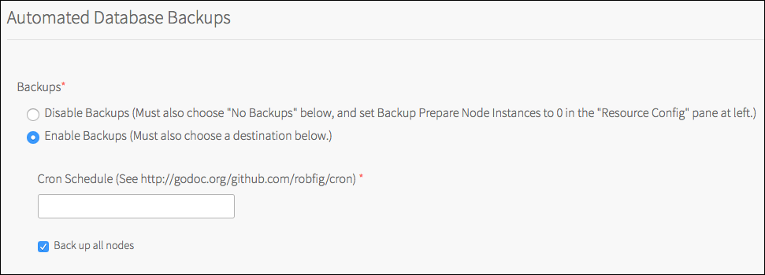
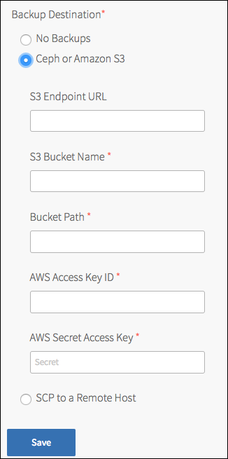
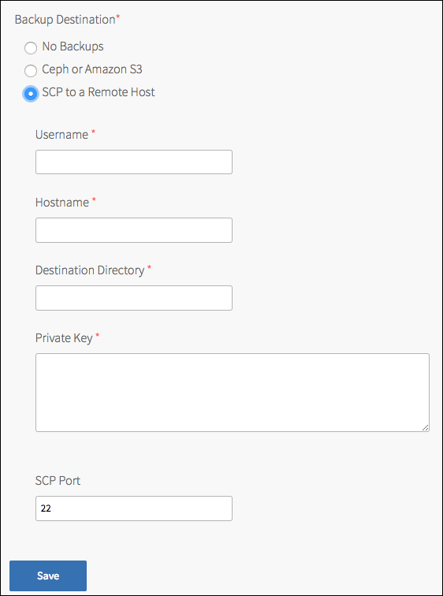
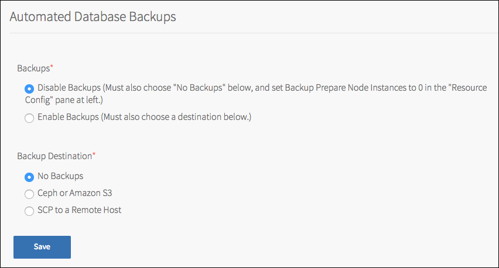
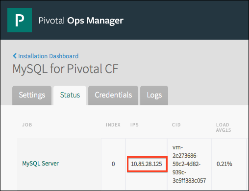
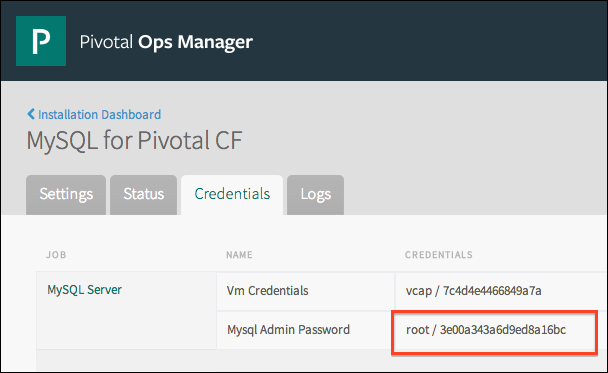

# Backing Up MySQL for Pivotal Cloud Foundry

This topic describes how to enable, configure, and use backups in MySQL for Pivotal Cloud Foundry (PCF).

## Overview ##

Automated backups have the following features:

- Periodically create and upload backup artifacts suitable for restoring the complete set of database instances allocated in the service
- No locks, no downtime
- The only effect on the serving systems is the amount of I/O required to copy the database and log files off of the VM
- Includes a metadata file that contains the critical details of the backup artifact, including the effective calendar time of the backup
- Backup artifacts are encrypted within the MySQL for PCF cluster of VMs; unencrypted data is never transported outside of the MySQL for PCF deployment

## Enable Automated Backups ##

You can configure MySQL for PCF to automatically back up its databases to external storage.

* **How and Where**: There are two options for how automated backups transfer backup data and where the data saves out to:
  - MySQL for PCF runs an `scp` command that secure-copies backup files to a VM or physical machine operating outside of PCF. The operator provisions the backup machine separately from their PCF installation. This is the most efficient option.
  - MySQL for PCF runs an [S3](https://aws.amazon.com/documentation/s3/) client that saves backups to an Amazon S3 bucket, [Ceph](http://docs.ceph.com/docs/master/) storage cluster, or other S3-compatible endpoint certified by Pivotal.

* **When**: Backups follow a schedule that you specify with a [cron](http://godoc.org/github.com/robfig/cron) expression.

* **What**: You can back up just the primary node, or all nodes in the cluster.

To enable automated backups and configure them for options above, perform the following steps:

1. Navigate to the MySQL for Pivotal Cloud Foundry tile on the Ops Manager Installation Dashboard.
1. Click **Backups**.
1. Under **Backups**, click **Enable Backups**.
  
1. For **Cron Schedule**, enter a cron schedule for the backups. The syntax is similar to traditional cron, with additional features such as `@every 1d`, which specifies daily backups. See the cron Go library [documentation](https://godoc.org/github.com/robfig/cron) for more information.
1. If you want to back up all nodes, select the **Back up all nodes** checkbox.
1. To enable backups using [Ceph](http://docs.ceph.com/docs/master/) or AWS, continue to the [Ceph or AWS](#ceph-aws) section. To enable backups using SCP, continue to the [SCP](#scp) section.

### Ceph or AWS

To back up your database on Ceph or Amazon Web Services (AWS) S3, perform the following steps:

1. Select **Ceph or Amazon S3**.
  <br>
1. Enter your **S3 Endpoint URL**. For instance, `https://s3.amazonaws.com`.
1. Enter your **S3 Bucket Name**. Do not include an `s3:// prefix`, a trailing `/`, or underscores. If the bucket does not already exist, it will be created automatically.
1. For **Bucket Path**, specify a folder within the bucket to hold your MySQL backups. Do not include a trailing `/`. If the folder does not already exist, it will be created automatically.
  !!! note 
      You must use this folder exclusively for this cluster's backup artifacts. Mixing the backup artifacts from different clusters within a single folder can cause confusion and possible inadvertent loss of backup artifacts.
1. For **AWS Access Key ID** and **AWS Secret Access Key**, enter your Ceph or AWS credentials. For AWS, Pivotal recommends creating an [IAM](https://aws.amazon.com/iam/) credential that only has access to this bucket.
1. Click **Save**.

### SCP

To back up your database using SCP, perform the following steps:

1. Select **SCP to a Remote Host**.

1. Enter the **Username**, **Hostname**, and **Destination Directory** for the backups.
  !!! note 
      Pivotal recommends using a VM not within the PCF deployment for the destination of SCP backups. SCP enables the operator to use any desired storage solution on the destination VM.
1. For **Private Key**, paste in the private key that will be used to encrypt the SCP transfer.
1. Enter the **SCP Port**. SCP runs on port 22 by default.
1. Click **Save**.

## Disable Automated Backups ##

To disable automated backups, perform the following steps:

1. Navigate to the MySQL for Pivotal Cloud Foundry tile on the Ops Manager Installation Dashboard.
1. Click **Backups**.
  
1. Under **Backups**, click **Disable Backups**.
1. Under **Backup Destination**, click **No Backups**.
1. Click **Save**.
1. In the left navigation, click **Resource Config**.
1. Change the number of instances for **Backup Prepare Node** from `1` to `0`.
1. Click **Save**.
1. Return to the Ops Manager Installation Dashboard and click **Apply Changes**.

To configure automated backups for MySQL for PCF, perform the following steps:

1. Navigate to the MySQL for Pivotal Cloud Foundry tile on the Ops Manager Installation Dashboard.
1. Click **Backups**.

## Understand Backup Metadata ##

Along with each release, MySQL for PCF will upload a `mysql-backup-XXXXXXXXXX.txt` metadata file. 

The contents of the metadata file resemble the following:

```
uuid = dfe9fcdd-7d0f-11e5-93b3-0695a7b9771f
name =
tool_name = innobackupex
tool_command = --user=root --password=... --stream=tar tmp/
tool_version = 1.5.1-xtrabackup
ibbackup_version = xtrabackup version 2.2.10 based on MySQL server 5.6.22 Linux (x86_64) (revision id: )
server_version = 10.0.21-MariaDB-wsrep
start_time = 2015-10-28 01:04:40
end_time = 2015-10-28 01:04:43
lock_time = 1
binlog_pos =
innodb_from_lsn = 0
innodb_to_lsn = 1730899
partial = N
incremental = N
format = tar
compact = N
compressed = N
encrypted = N
```

Within this file, the most important items are the `start_time` and the `server_version` entries. Transactions that have not been completed at the start of the backup effort will not be present in the restored artifact.

!!! note 
    Both <code>compressed</code> and <code>encrypted</code> show as <code>N</code> in this file, yet the artifact uploaded by MySQL for PCF is both compressed and encrypted. This is a known bug.

## Restore a Backup Artifact ###

MySQL for PCF keeps at least two complete copies of the data. In most cases, if a cluster is still able to connect to persistent storage, you can restore a cluster to health using the [bootstrap process](bootstrapping.html). Before resorting to a database restore, contact [Pivotal Support](https://support.pivotal.io) to ensure your existing cluster is beyond help.

The disaster recovery backups feature of MySQL for PCF is primarily intended as a way to recover data to the same PCF deployment from which the data was backed up. This process replaces 100% of the data and state of a running MySQL for PCF cluster. This is especially relevant with regard to service instances and bindings. 

!!! note
    Because of how services instances are defined, you cannot restore a MySQL for PCF database to a different PCF deployment.

In the event of a total cluster loss, the process to restore a backup artifact to a MySQL for PCF cluster is entirely manual. Perform the following steps to use the offsite backups to restore your cluster to its previous state:

1. Discover the encryption keys in the **Credentials** tab of the MySQL for PCF tile.
1. If necessary, install the same version of the **MySQL for PCF** product in the Ops Manager Installation Dashboard.
1. Perform the following steps to reduce the size of the MySQL for PCF cluster to a single node:
    1. From the Ops Manager Installation Dashboard, click the **MySQL for PCF** tile.
    1. Click **Resource Config**.
    1. Set the number of instances for **MySQL Server** to 1.
    1. Click **Save**.
    1. Return to the Ops Manager Installation Dashboard and click **Apply Changes**.
1. After the deployment finishes, perform the following steps to prepare the first node for restoration:
    1. SSH into the Ops Manager Director. For more information, see the [SSH into Ops Manager](http://docs.pivotal.io/pivotalcf/customizing/trouble-advanced.html#ssh) section in the <em>Advanced Troubleshooting with the BOSH CLI</em> topic.
    1. Retrieve the IP address for the MySQL server by navigating to the **MySQL for PCF** tile and clicking the **Status** tab.
    1. Retrieve the VM credentials for the MySQL server by navigating to the **MySQL for PCF** tile and clicking the **Credentials** tab.
    1. From the Ops Manager Director VM, use the BOSH CLI to SSH into the first MySQL job. For more information, see the [BOSH SSH](http://docs.pivotal.io/pivotalcf/1-7/customizing/trouble-advanced.html#bosh-ssh) section in the <em>Advanced Troubleshooting with the BOSH CLI</em> topic.
    1. On the MySQL server VM, become super user:
      <p class="terminal">$ sudo su</p>
    1. Pause the local database server:
      <p class="terminal">$ monit stop all</p>
    1. Confirm that all jobs are listed as `not monitored`:
      <p class="terminal">$ watch monit summary</p>
    1. Delete the existing MySQL data that is stored on disk:
      <p class="terminal">$ rm -rf /var/vcap/store/mysql/*</p>
1. Perform the following steps to restore the backup:
    1. Move the compressed backup file to the node using `scp`.
    1. Decrypt the file using the `gpg` command:
      <p class="terminal">$ gpg --decrypt mysql-backup.tar.gpg</p>
    1. Expand the backup artifact into the data director of MySQL:
      <p class="terminal">$ tar xvjf mysql-backup.tar.bzip2 --directory=/var/vcap/store/mysql</p>
    1. Change the owner of the data directory, because MySQL expects the data directory to be owned by a particular user:
      <p class="terminal">$ chown -R vcap:vcap /var/vcap/store/mysql</p>
    1. Start all services with `monit`:
      <p class="terminal">$ monit start all</p>
    1. Watch the summary until all jobs are listed as `running`:
      <p class="terminal">$ watch monit summary</p> 
    1. Exit out of the MySQL node.
1. Perform the following steps to increase the size of the cluster back to three:
    1. From the Ops Manager Installation Dashboard, click the **MySQL for PCF** tile.
    1. Click **Resource Config**.
    1. Set the number of instances for **MySQL Server** to 1.
    1. Click **Save**.
    1. Return to the Ops Manager Installation Dashboard and click **Apply Changes**.

## Perform Manual Backup ##

If you do not want to use the automated backups included in MySQL for PCF, you can perform backups manually.

### Retrieve IP Address and Credentials ###

Perform the following steps to retrieve the IP address and credentials required for a manual backup:

1. From the Ops Manager Installation Dashboard, click the **MySQL for PCF** tile. 
1. Click the **Status** tab.
1. Locate the IP address for the MySQL node under **MySQL Server**.
    
1. Locate the root password for the MySQL server in the **Credentials** tab.
    

### Manual Backup ###

Back up your data manually with [mysqldump](https://mariadb.com/kb/en/mariadb/mysqldump/).
  This backup acquires a global read lock on all tables, but does not hold it for the entire duration of the dump.

To back up all databases in the MySQL deployment, use the `--all-databases` flag:
<p class="terminal">$ mysqldump -u root -p -h $MYSQL\_NODE\_IP \<br>--all-databases > user_databases.sql</p>

To back up a single database, specify the database name:
<p class="terminal">$ mysqldump -u root -p -h $MYSQL\_NODE\_IP $DB\_NAME > user_databases.sql</p>

### Manual Restore ###

The procedure for restoring from a backup is the same whether one or multiple databases were backed up.
Executing the SQL dump will drop, recreate, and refill the specified databases and tables.

!!! warning
    Restoring a database will delete all data that existed in the database prior to the restore. Restoring a database using a full backup artifact, produced by <code>mysqldump --all-databases</code> for example, will replace all data and user permissions.

To restore from the data dump, run the following command:

<p class="terminal">$ mysql -u root -p -h $MYSQL\_NODE\_IP < user\_databases.sql</p>

To re-apply users privileges, tell the cluster to re-load user permissions using the data that has just been restored:

<p class="terminal">$ mysql -u root -p -h $MYSQL\_NODE\_IP -e "FLUSH PRIVILEGES"</p>

For more examples of manual backup and restore procedures, see the [MariaDB documentation](http://mariadb.com/kb/en/mariadb/mysqldump/#examples).
