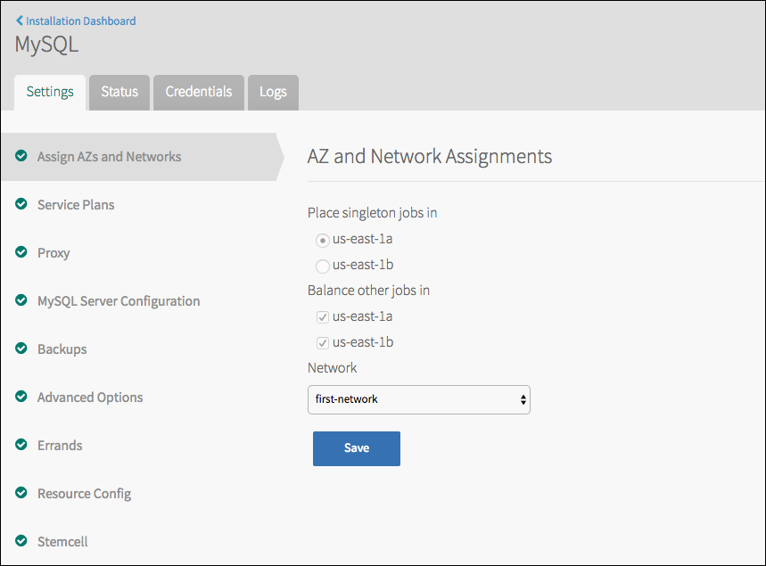
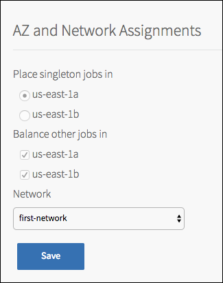
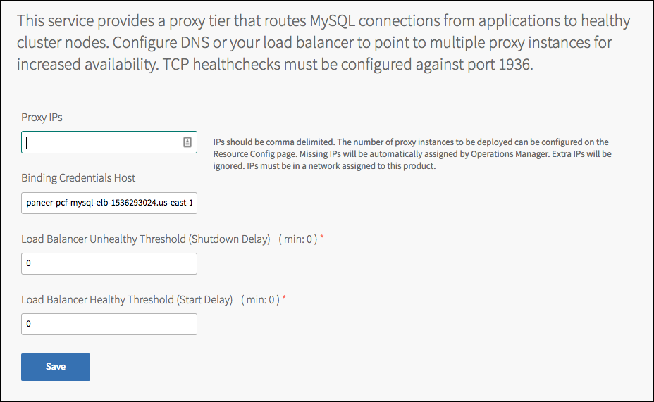
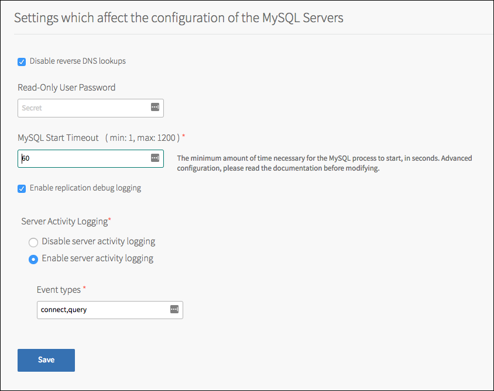
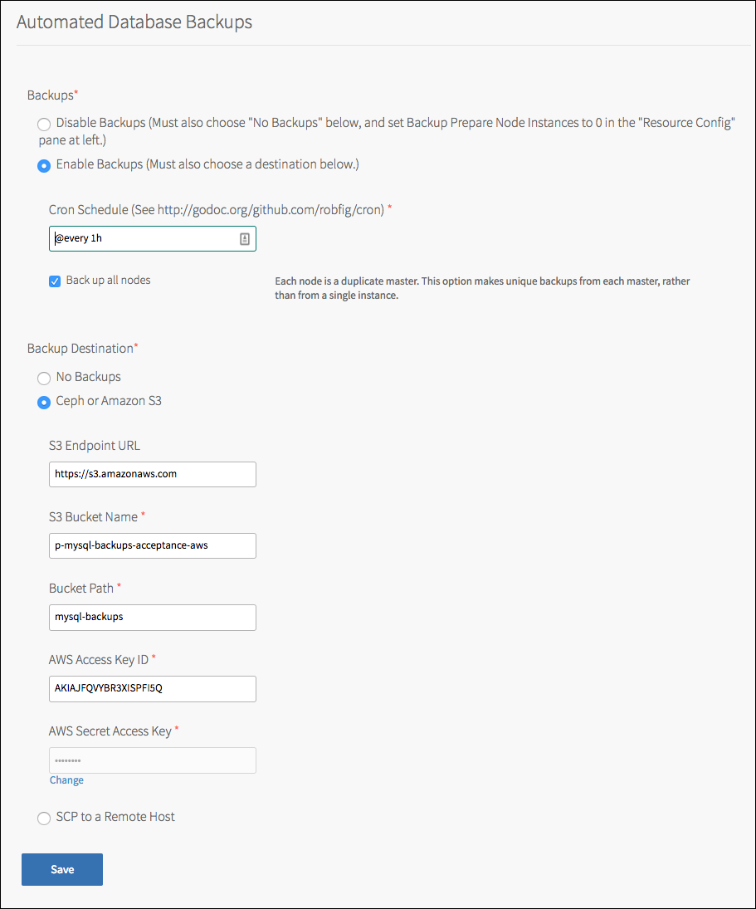
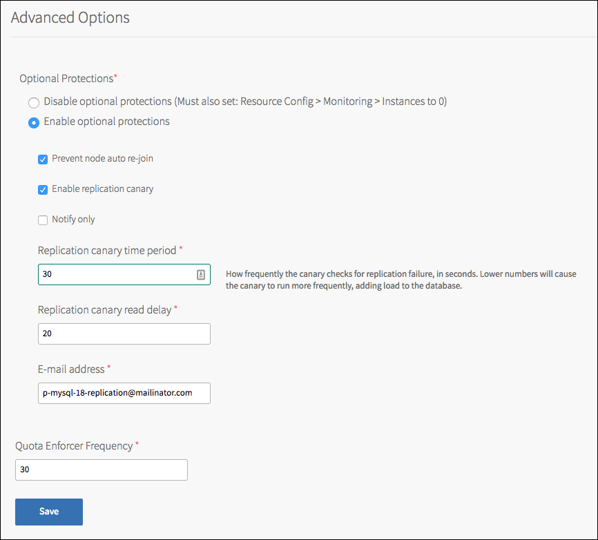
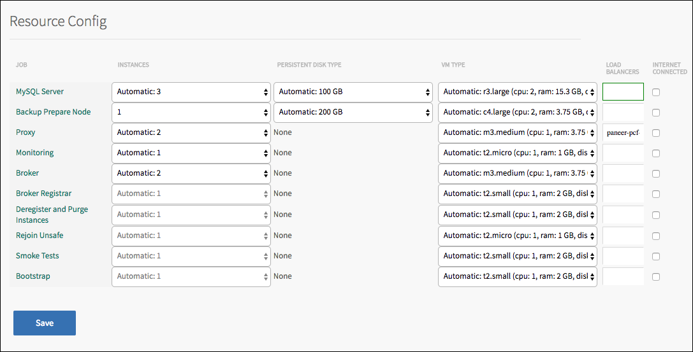

# Configuring MySQL for PCF

This topic explains how to configure the MySQL for PCF service.

To configure your MySQL service, click the **MySQL for PCF** tile in the Ops Manager **Installation Dashboard**, open each pane under the **Settings** tab, and review or change the configurable settings as described in the sections below.

## Assign AZs and Networks

MySQL for PCF supports deployment to multiple availability zones (AZs).

To maximize uptime, deploy a load balancer in front of the SQL Proxy nodes. Please see the note in the [proxy](#proxy) section below. When configuring this load balancer, increase the minimum idle timeout if possible, as many load balancers are tuned for short-lived connections unsuitable for long-running database queries. See the [load balancer configuration instructions](installing/#load-balancer) for details.

## Service Plans

Service plans offer developers different versions of the MySQL service. An example is tiered service plans with that offer a range of resource limits and pricing. See [Service Plans](service-plan) for how to configure one or more service plans in the **Service Plans** pane.

!!! note 
    You cannot deploy MySQL for PCF without at least one service plan defined.

## Proxy

The proxy tier routes connections from apps to healthy MariaDB cluster nodes, even in the event of node failure.

- In the **Proxy IPs** field, enter a list of IP addresses that should be assigned to the proxy instances. These IP addresses must be in the CIDR range configured in the Director tile and not be currently allocated to another VM. Look at the **Status** pages of other tiles to see what IP addresses are in use.

- In the **Binding Credentials Hostname** field, enter the hostname or IP address that should be given to bound applications for connecting to databases managed by the service. This hostname or IP address should resolve to your load balancer and be considered long-lived. When this field is modified, applications must be rebound to receive updated credentials.

To enable their PCF apps to use a MySQL database, developers bind their apps to instances of the MySQL for PCF service. For more information, see [Application Binding](http://docs.pivotal.io/pivotalcf/devguide/services/index.html#application-binding). By default, the MySQL service provides bound apps with the IP address of the first instance in the proxy tier, even with multiple proxy instances deployed. This makes the first proxy instance a single point of failure unless you deploy a load balancer.

!!! note 
    To eliminate the first proxy instance as a single point of failure, configure a load balancer to route client connections to all proxy IPs, and configure the MySQL service to give bound applications a hostname or IP address that resolves to the load balancer.

### Proxy Count Cannot be Reduced

Once an operator deploys MySQL for PCF, they cannot reduce the number of proxy IPs or proxy instances, and cannot remove the configured IPs from the **Proxy IPs** field.

If the product is initially deployed without proxy IPs, adding IPs to the **Proxy IPs** field can only add additional proxy instances. Scaling down is unpredictably permitted, and the first proxy instance can never be assigned an operator-configured IP.

## MySQL Server Configuration

- **Disable Reverse DNS lookups**

    This feature is enabled by default, and improves performance. Clearing this option causes the MySQL servers to perform a reverse DNS lookup on each new connection, for example to restrict access by hostname. typical MySQL for PCF installations do not need reverse DNS lookups.

- **Read-Only User Password**

    Activates a special user, `roadmin`, a read-only administrator. Supply a special password for administrators who require the ability to view all of the data maintained by the MySQL for PCF installation. Leaving this field blank de-activates the read-only user.

- **MySQL Start Timeout**

    The minimum amount of time necessary for the MySQL process to start, in seconds. When restarting the MySQL server processes, there are conditions under which the process takes longer than expected to appear as running. This can cause parts of the system automation to assume that the process has failed to start properly, and will appear as failing in Ops Manager and BOSH output. Depending on the data stored by the database, and the time represented in logs, you may need to increase this above the default of 60 seconds.

- **Enable replication debug logging**

    By default, the MySQL for PCF service logs replication error events. Disable this option only if error logging is straining your logging systems.

- **Server Activity Logging**

    The MySQL service includes the [MariaDB Audit plugin](https://mariadb.com/kb/en/mariadb/about-the-mariadb-audit-plugin/) to log server activity. You can disable this plugin, or configure which [events](https://mariadb.com/kb/en/mariadb/about-the-mariadb-audit-plugin/#logging-events) are recorded. The log can be found at `/var/vcap/store/mysql_audit_logs/mysql_server_audit.log` on each VM. When server logging is enabled, the file is rotated every 100 megabytes, and the 30 most recent files are retained.

    !!! note 
    Due to the sensitive nature of these logs, they are not transmitted to the syslog server.

## Backups

See the [Backups](backup) topic for instructions on configuring backups.

## Advanced Options

The **Advanced Options** pane lets you configure the following features:

- The Replication Canary, see [Monitoring the MySQL Service](monitoring-mysql/#repcanary).

- The Interruptor, see the [Interruptor documentation](troubleshooting/#interruptor).

- **Quota Enforcer Frequency**

    By default, the Quota Enforcer polls for violators and reformers every 30 seconds. This setting, in seconds, changes how long the quota enforcer pauses between checks.
    Quota Enforcer polling draws minimal resources, but if you want to reduce this load, increase this interval. Be aware, however, that a long Quota Enforcer interval may cause apps to write more data than their pre-determined limit allows.

## Errands

Two post-deploy errands run by default: the **broker registrar** and the **smoke test**. The broker registrar errand registers the broker with the Cloud Controller and makes the service plan public. The smoke test errand runs basic tests to validate that service instances can be created and deleted, and that apps pushed to Elastic Runtime can be bound and write to MySQL service instances. You can turn both errands on or off in the **Errands** pane under the **Settings** tab.

!!! note 
    The <strong>Errands</strong> pane also shows a <b>broker-deregistrar</b> pre-delete errand. Do not run this errand unless instructed to do so by Support. Ops Manager runs the broker-deregistrar errand to clean up when it uninstalls a tile. Running <code>bosh run errand broker-registrar</code> under any other circumstances deletes user data.

## Resource Config

This pane configures the number, persistent disk capacity, and VM type for all component VMs that run the MySQL for PCF service.

Make sure to provision ample resources for your **MySQL Server** nodes. MariaDB servers require sufficient CPU, RAM, and IOPS to promptly respond to client requests. Also note that the MySQL for PCF reserves about 2-3 GB of each instance's persistent disk for service operations use. The rest of the capacity is available for the databases. The MariaDB cluster nodes are configured by default with 100GB of persistent disk. The deployment will fail if this is less than 3GB; we recommend allocating 10GB minimum.

###  Switch Between Single and HA Topologies

To switch your MySQL for PCF service between single-node and high availability (HA) topologies, navigate to the **Resource Config** pane and change the **Instances** settings for the **MySQL Server**, **Proxy**, and **Service Broker** components as shown in this table:

<table>
<tr><th>Resource</th><th>Single-Node</th><th>High Availability (HA)</th></tr>
<tr><td>MySQL Server</td><td>1</td><td>3</td></tr>
<tr><td>Proxy</td><td>1</td><td>2</td></tr>
<tr><td>Service Broker</td><td>1</td><td>1-2*</td></tr>
</table>

*Routine database operations do not require two service brokers.

Single and three-node clusters are the only supported topologies. Ops Manager  allows you to set the number of **MySQL Server** instances to other values, but Pivotal recommends only one or three.

If you scale up to three MySQL nodes, Pivotal recommends spreading them across different Availability Zones to maximize cluster availability. An Availability Zone (AZ) is a network-distinct section of a region. For more information about Amazon AZs, see [Amazon's documentation](https://docs.aws.amazon.com/AWSEC2/latest/UserGuide/using-regions-availability-zones.html).

When you change the instance counts for a MySQL service, a top-level property is updated with the new nodes' IP addresses. As BOSH deploys, it will update the configuration and restart all of the MySQL nodes **and** the proxy nodes (to inform them of the new IP addresses as well). Restarting the nodes will cause all connections to that node to be dropped while the node restarts.

## Stemcell

This pane uploads the stemcell that you want the service components to run on. Find available stemcells at [Pivotal Network](http://network.pivotal.io).
