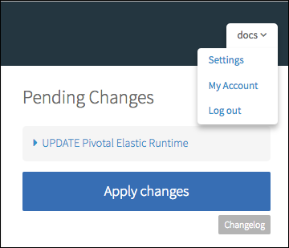

# Rotating MySQL for PCF Credentials

This topic describes how to rotate credentials for MySQL for Pivotal Cloud Foundry (MySQL for PCF). If you are also using Elastic Runtime MySQL, review the notes in this procedure in order to rotate credentials for both products.

## Prerequisites

To perform the steps below, you need to obtain the following:

1. Your root CA certificate in a `.crt` file. To retrieve the root CA certificate of your deployment, follow these steps:

  1. In Ops Manager, click your username located at the top right and choose **Settings**. 
    
  1. Click **Advanced**. 
      

  1. Click **Download Root CA Cert**.

1. Your MySQL for PCF root password. To retrieve your MySQL for PCF root password, navigate to the Ops Manager Installation Dashboard and select <strong>MySQL for Pivotal Cloud Foundry > Credentials</strong>. Your MySQL for PCF root password is called `Mysql Admin Password`.  
   

    !!! note 
        If you use Elastic Runtime MySQL, you also need your Elastic Runtime MySQL root password. To retrieve your Elastic Runtime MySQL root password, navigate to the Ops Manager <strong>Installation Dashboard</strong> and select <strong>MySQL > Credentials</strong>. Your Elastic Runtime MySQL root password is called <code>Mysql Admin Credentials</code>.

## Rotate Your MySQL for PCF Credentials

1. Install the User Account and Authentication (UAA) Command Line Interface (UAAC).
  
$ gem install cf-uaac

1. Make sure `uaac` gem is installed.
  
$ which uaac
    /Users/pivotal/.gem/ruby/2.3.0/bin/uaac

1. Target your Ops Manager UAA and provide the path to your root CA certificate. 
  
$ uaac target https://YOUR-OPSMAN-FQDN/uaa/ --ca-cert YOUR-ROOT-CA.crt 
  Target: https://YOUR-OPSMAN-FQDN/uaa/

1. Get your token with `uaac token owner get`. 
  * Enter `opsman` for `Client ID`.
  * Press enter for `Client secret` to leave it blank. 
  * Use the user name and password you used above to log into the Ops Manager web interface for `User name` and `Password`.
  
$ uaac token owner get
  Client ID:  opsman
  Client secret:
  User name:  admin
  Password:  *********
  Successfully fetched token via owner password grant.
  Target: https://YOUR-OPSMAN-FQDN/uaa
  Context: admin, from client opsman

1. Run the following command to display the users and applications authorized by the UAA server, and the permissions granted to each user and application.
  
$ uaac context
  [1]**[https://YOUR-OPSMAN-FQDN/uaa]
  skip\_ssl\_validation: true
  ca\_cert: /Users/pivotal/.ssh/YOUR-ROOT-CA.crt
  [0]*[admin]
  user\_id: 75acfdfa-9449-4497-a093-ce40ded250ac
  client\_id: opsman
  access\_token: LONG\_ACCESS\_TOKEN\_STRING
  token\_type: bearer
  refresh\_token: LONG\_REFRESH\_TOKEN\_STRING
  expires\_in: 43199
  scope: clients.read opsman.user uaa.admin scim.read opsman.admin clients.write scim.write
  jti: 8419c793d377429aa40eea07fb6e7686

1. Create a file called `uaac-token` that contains only the <code>LONG\_ACCESS\_TOKEN\_STRING</code> from the output above. 

1. Use `curl` to make a request to the Ops Manager API. Authenticate with the contents of the `uaac-token` file and pipe the response into `installation_settings_current.json`.

$ curl -skH "Authorization: Bearer $(cat uaac-token)" \
  https://YOUR-OPSMAN-FQDN/api/installation_settings > installation\_settings\_current.json

1. Check to see that the MySQL for PCF [root password](#prereqs) is in the current installation settings file:
  
$ grep -c YOUR-MYSQL-FOR-PCF-ROOT-PASSWORD installation\_settings\_current.json

    !!! note 
        If you use Elastic Runtime MySQL, you should also run the following command: <code>grep -c YOUR-ERT-MYSQL-ROOT-PASSWORD installation\_settings\_current.json</code>

1. Remove the root password from the installation settings file.
  
$ sed -e's/"value":{"identity":"root","password":"[^"]*"},
    \\("identifier":"mysql\_admin\\)/\1/g' installation\_
    settings\_current.json > installation\_settings\_updated.json

1. Validate that the root password has been removed from the `installation_settings_updated.json` file.
  
$ grep -c YOUR-MYSQL-FOR-PCF-ROOT-PASSWORD 
    installation\_settings\_updated.json

    !!! note 
        If you use Elastic Runtime MySQL, you should also run the following command: <code>$ grep -c YOUR-ERT-MYSQL-ROOT-PASSWORD installation\_settings\_updated.json</code>

1. Upload the updated installation settings.
   
$ curl -skX POST -H "Authorization: Bearer $(cat uaac-token)" \ 
    "https://YOUR-OPSMAN-FQDN/uaa/api/installation\_settings" \
    -F 'installation[file]=@installation\_settings\_updated.json' {}

1. Navigate to the Ops Manager **Installation Dashboard** and click **Apply Changes**.

1. Once the installation has completed, validate that the MySQL for PCF root password has been changed. Retrieve the new [password](#prereqs) from <strong>MySQL > Credentials</strong>. Use the IP address for the **MySQL Proxy** located in the **Status** tab.
   
$ mysql -uroot -p -h 192.0.2.0
  Enter password:
  Welcome to the MariaDB monitor.  Commands end with ; or \g.
  [...]

      !!! note 
          If you use Elastic Runtime MySQL, you should also validate that the Elastic Runtime MySQL root password has been changed. Retrieve the new password from <strong>Elastic Runtime > Credentials</strong>. Use the IP address for the **MySQL Proxy**, located in the **Status** tab.