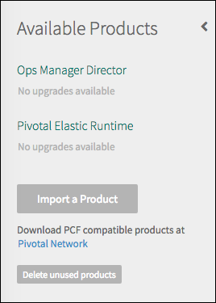
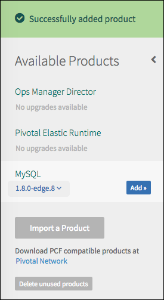
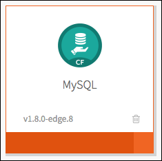
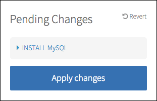

Installing MySQL for PCF

This topic explains how to install MySQL for Pivotal Cloud Foundry (PCF).

## Plan your Deployment ##

### Network Layout ##

MySQL for PCF supports deployment to multiple availability zones (AZs) on vSphere only. On other infrastructures, specify only one AZ.

To optimize uptime, deploy a load balancer in front of the SQL Proxy nodes. Configure the load balancer to route client connections to all proxy IPs, and configure the MySQL service to give bound applications a hostname or IP address that resolves to the load balancer. This eliminates the first proxy instance as a single point of failure. See [Configure a Load Balancer](#load-balancer) below for load balancer configuration recommendations.

If you deploy the MySQL service on a different network than Elastic Runtime, configure the firewall rules as follows to allow traffic between Elastic Runtime and the MySQL service.

| Type | Listening service | TCP Port |
| ---- | ---- | ---- |
| Inbound/TCP | Service broker | 8081 |
| Inbound/TCP | SQL proxy | 3306 |
| Inbound/TCP | Proxy health check | 1936 |
| Inbound/TCP | Proxy API | 8080 |
| Inbound/TCP | Proxy health check | 1936 |
| Outbound/TCP | NATS | 4222 |
| Internal/TCP | MySQL server | 3306 |
| Internal/TCP | Galera | 4567 |
| Internal/TCP | Galera health check | 9200 |

### Configure a Load Balancer

For high availability, Pivotal recommends using a load balancer in front of the proxies:

* **Configure your load balancer for failover-only mode.** Failover-only mode sends all traffic to one proxy instance at a time, and redirects to the other proxy only if the first proxy fails. This behavior prevents deadlocks when different proxies send queries to update the same database row. This can happen during brief server node failures, when the active server node changes.  
Amazon ELB does not support this mode; see [AWS Route 53](#route-53) for the alternative configuration.

* **Make your idle time out long enough to not interrupt long-running queries.** When queries take a long time, the load balancer can time out and interrupt the query.  
For example, [AWS's Elastic Load Balancer](http://docs.aws.amazon.com/elasticloadbalancing/latest/classic/config-idle-timeout.html) has a default idle timeout of 60 seconds, so if a query takes longer than this duration then the MySQL connection will be severed and an error will be returned.

* **Configure  a healthcheck or monitor, using TCP against port 1936**. This defaults to TCP port `1936`, to maintain backwards compatibility with previous releases. This port is not configurable. Unauthenticated healthchecks against port 3306 may cause the service to become unavailable and require manual intervention to fix.

* **Configure the load balancer to route traffic for TCP port 3306 to the IPs of all proxy instances on TCP port 3306**. 

After you install MySQL for PCF, you [assign IPs to the proxy instances](configuring/#proxy) in Ops Manager.

#### AWS Route 53 ###

Use AWS Route 53 to set up Round Robin DNS across multiple proxy IPs as follows:

1. Log in to AWS.
2. Click **Route 53**.
3. Click **Hosted Zones**.
4. Select the hosted zone that contains the domain name to apply round robin routing to.
5. Click **Go to Record Sets**.
6. Select the record set containing the desired domain name.
7. In the value input, enter the IP addresses of each proxy VM, separated by a newline.

Finally, update the manifest property `properties.mysql_node.host` for the cf-mysql-broker job, as described above.

#### Add a Load Balancer to an Existing Installation

If you initially deploy MySQL for PCF v1.5.0 without a load balancer and without proxy IPs configured, you can set up a load balancer later to remove the proxy as a single point of failure. When adding a load balancer to an existing installation, you need to:

- Rebind your apps to receive the hostname or IP that resolves to the load balancer. To rebind: unbind your application from the service instance, bind it again, then restage your application. For more information see [Managing Service Instances with the CLI](http://docs.pivotal.io/pivotalcf/devguide/services/managing-services.html). In order to avoid unnecessary rebinding, we recommend configuring a load balancer before deploying v1.5.0.
- Instead of configuring the proxy IPs in Ops Manager, configure DNS for your load balancer to point to the IPs that were dynamically assigned to your proxies. You can find these IPs in the **Status** tab. Configuration of proxy IPs after the product is deployed with dynamically assigned IPs is not well supported.

### Create an Application Security Group

Create an [Application Security Group](http://docs.pivotal.io/pivotalcf/adminguide/app-sec-groups.html) (ASG) for MySQL for PCF to allow apps to access to the service. See [Creating Application Security Groups for MySQL](app-security-groups) for instructions.

!!! note 
    The service will not be usable until an ASG is in place.

## Install the MySQL for PCF Tile

1. Download the product file from [Pivotal Network](https://network.pivotal.io/products/p-mysql).

1. Navigate to the Ops Manager Installation Dashboard.

	

1. Click **Import a Product** to upload the product file to your Ops Manager installation.

	

1. Click **Add** next to the uploaded product description in the **Available Products** view to add this product to your staging area.

	

1. Click the newly-added tile to configure the settings for your MySQL for PCF service, including its service plans. See [Configuring MySQL for PCF](configuring) for instructions.

	

1. Click **Apply Changes** to deploy the service.
