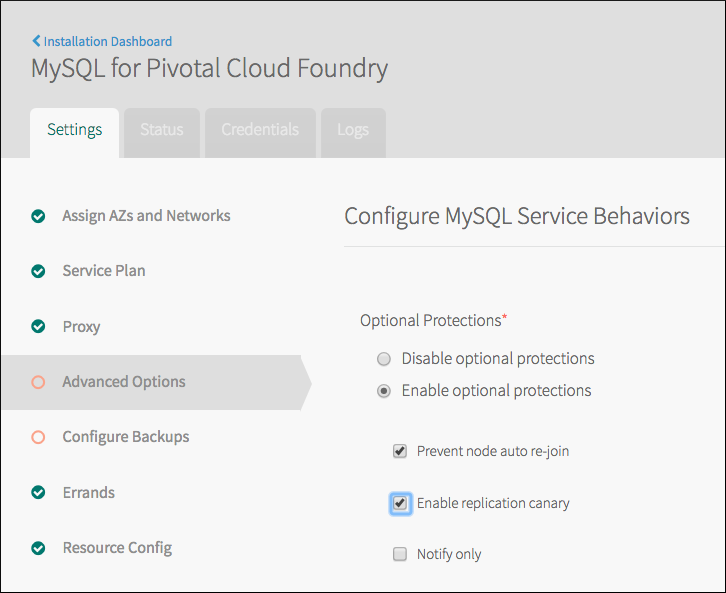

# Monitoring the MySQL Service

This document describes how to use the Replication Canary and Interruptor to monitor your MySQL cluster.

## Replication Canary

MySQL for Pivotal Cloud Foundry (PCF) is a clustered solution that uses replication to  provide benefits such as quick failover and rolling upgrades. This is more complex than a single node system with no replication. MySQL for PCF includes a Replication Canary to help with the increased complexity. The Replication Canary is a long-running monitor that validates that replication is working within the MySQL cluster.

### How it Works

The Replication Canary writes to a private dataset in the cluster, and attempts to read that data from each node. It pauses between writing and reading to ensure that the writesets have been committed across each node of the cluster. The private dataset does not use a significant amount of disk capacity.

When replication fails to work properly, the Canary detects that it cannot read the data from all nodes, and immediately takes two actions:

  - Emails a pre-configured address with a message that replication has failed. See the [sample](#sample-canary) below.
  - Disables client [access to the cluster](#access).

    !!! failure 
        Malfunctioning replication exposes the cluster to the possibility of data loss. Because of this, both behaviors are enabled by default. It is critical that you contact Pivotal support immediately in the case of replication failure. Support will work with you to determine the nature of the cluster failure and provide guidance regarding a solution.

### Sample Notification Email

If the Canary detects a replication failure, it immediately sends an email through the Elastic Runtime notification service. See the following example:

    Subject: CF Notification: p-mysql Replication Canary, alert 417

    This message was sent directly to your email address.

    {alert-code 417}
    This is an email to notify you that the MySQL service's replication canary has detected an unsafe cluster condition in which replication is not performing as expected across all nodes.

### Cluster Access

Each time the Canary detects cluster replication failure, it instructs all proxies to disable connections to the database cluster. If the replication issue resolves, the Canary detects this and automatically restores client access to the cluster.

If you must restore access to the cluster regardless of the Replication Canary, contact Support.

#### Determine Proxy State

You can determine if the Canary disabled cluster access by using the Proxy API. See the following example:

ubuntu@ip-10-0-0-38:~$ curl -ku admin:PASSWORD_FROM_OPSMGR \
  -X GET https://proxy-0-p-mysql.SYSTEM-DOMAIN/v0/cluster ; 
  echo {"currentBackendIndex":0,"trafficEnabled":
  false,"message":"Disabling cluster traffic",
  "lastUpdated":"2016-07-27T05:16:29.197754077Z"}

### Enable the Replication Canary

To enable the Replication Canary, follow the instructions below to configure both the Elastic Runtime tile and the MySQL for PCF tile.

#### Configure the Elastic Runtime Tile

!!! note 
    In a typical PCF deployment, these settings are already configured.
1. In the **SMTP Config** section, enter a **From Email** that the Replication Canary can use to send notifications, along with the SMTP server configuration.
1. In the **Errands** section, select the **Notifications** errand.

#### Configure the MySQL for PCF Tile

1. In the **Advanced Options** section, select **Enable replication canary**.
    
1. If you want to the Replication Canary to send email but not disable access at the proxy, select **Notify only**.

    !!! note 
        Pivotal recommends leaving this checkbox unselected due to the possibility of data loss from replication failure.

1. You can override the **Replication canary time period**. The **Replication canary time period** sets how frequently the canary checks for replication failure, in seconds. This adds a small amount of load to the databases, but the canary reacts more quickly to replication failure. The default is 30 seconds.

    

1. You can override the **Replication canary read delay**. The **Replication canary read delay** sets how long the canary waits to verify data is replicating across each MySQL node, in seconds. Clusters under heavy load experience some small replication lag as writesets are committed across the nodes. The Default is 20 seconds.
1. Enter an **Email address** to receive monitoring notifications. Use a closely monitored email address account. The purpose of the Canary is to escalate replication failure as quickly as possible.
1. In the **Resource Config** section, ensure the **Monitoring** job has one instance.
  

### Disable the Replication Canary

If you do not need the Replication Canary, for instance if you use a single MySQL node, follow this procedure to disable both the job and the resource configuration.

1. In the **Advanced Options** section of the MySQL for PCF tile, select **Disable Replication Canary**. 

    

1. In the **Resource Config** pane, set the **Monitoring** job to zero instances. 

    
