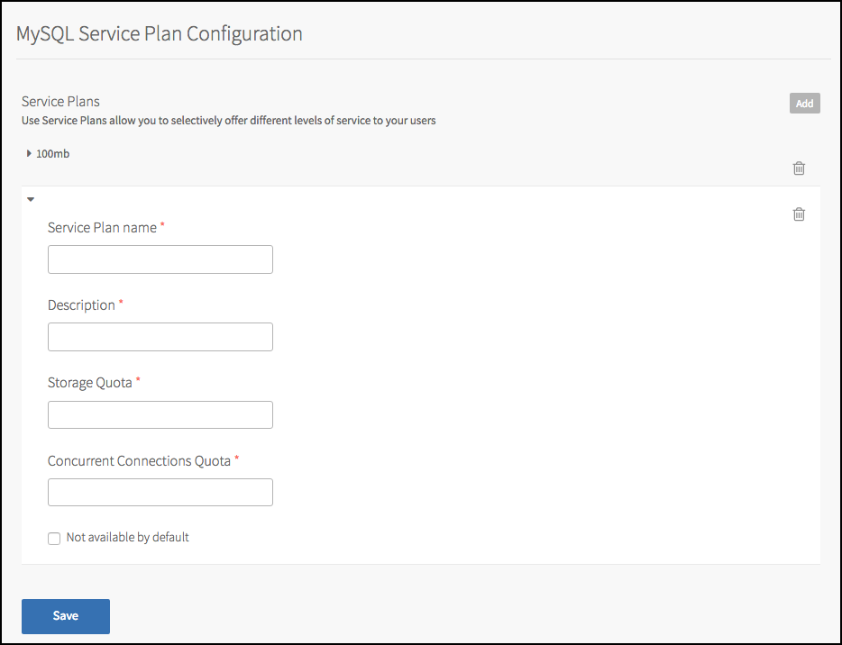

# Service Plans

Operators can configure multiple MySQL service plans in the **Service Plans** pane of the Ops Manager MySQL tile. Follow the instructions below to [add](#add-plan), [modify](#modify-plan), or [delete](#delete-plan) service plans.

!!! note 
    Prior to v1.8.0, MySQL for PCF supported only one service plan. Upgrading from v1.7.x or earlier renames this plan to  <code>pre-existing-plan</code> by default. To retain the original name of your plan (e.g., "100mb-dev"), edit its <strong>Service Plan name</strong> field in the <strong>Service Plans</strong> pane before clicking <strong>Apply Changes</strong>

## Add a Plan

1. Navigate to the Ops Manager Installation Dashboard and click the **MySQL for PCF** tile.
1. Click **Service Plans**.
1. Click **Add** to add a new service plan. Click the small triangles to expand or collapse a plan's details.
	
1. Complete the following fields:
	- **Service Plan name**: Developers see this name in the Services Marketplace and use it to create service instances in Apps Manager and the cf CLI. Plan names may include only lowercase letters, numbers, hyphens, and underscores.
	  
<strong>Note</strong>: Ops Manager does not prevent you from entering invalid names into the <strong>Service Plan name</strong> field. A plan name containing invalid characters prevents the tile from deploying after you click <strong>Apply Changes</strong> and generates an error like this in the installation log:
	    <code>
	    Error 100: Error filling in template 'settings.yml.erb' for 'cf-mysql-broker-partition-20d9770a220f749796c2/0' (line 40: Plan name 'ONE HUNDRED MEGA BYTES!!!' must only contain lowercase letters, numbers, hyphen(-), or underscore(_).)
	    </code>
	  

	- **Description**: This descriptive text accompanies the plan name to provide context. For example, "general use, small footprint."
	- **Storage Quota**: The maximum amount, in megabytes, of storage allowed each instance of the service plan.
	- **Concurrent Connections Quota**: The maximum number of simultaneous database connections allowed to each instance of the service plan.
	- **Not available by default**: By default, plans are _public_ and publish to all orgs. Selecting this checkbox makes the plan _private_, which means the operator must publish the plan manually before developers can use it.
	See [Access Control](http://docs.pivotal.io/pivotalcf/services/access-control.html) for how to change the scope of publication for service plans already deployed.

	- The **Concurrent Connections Quota** field sets the `max_user_connections` property for an existing plan.

Changing the **Concurrent Connections Quota** does not affect the connections currently open. For example, if you decrease this value from 40 to 20, apps already running with 40 open connections will retain their connections. To  force an app's open connection count down to the new limit, an operator can restart the proxy job. Otherwise, the number of connections will eventually converge down to the new limit on its own, because when any app connection above the limit is reset, it won't reconnect.

!!! note 
    You cannot deploy MySQL for PCF without at least one plan defined. If you want to deploy the MySQL tile so that no plans are visible to developers, define one plan, select <strong>Not available by default</strong> to make the plan private, and only enable access to your own org.

##  Modify a Plan

To modify an existing service plan, change its configuration values in the Ops Manager **MySQL** tile **Service Plans** pane, click **Save** and then click **Apply Changes** in the Installation Dashboard.

Do not decrease the **Storage Quota** value for a plan, and only decrease the **Concurrent Connections Quota** value if you are confident that all apps using the plan use fewer concurrent connections than allowed. Reducing these values could cause app failure when existing service instances update. Instead of decreasing quotas for a plan, create a new plan with lower quotas.

After an operator changes a plan's definition, either the operator or a user must update each plan instance by running <code>cf update-service SERVICE\_INSTANCE -p NEW\_PLAN\_NAME</code> on the command line.

### Update Existing Service Instances

After you change a service plan, all new services will reflect the new settings. To apply a change to existing services, update service instances using the cf CLI as follows:

$ cf update-service SERVICE_INSTANCE -p NEW_PLAN

The following rules apply when updating a service instance's plan:

* You can always update a service instance to a plan with a larger `max_storage_mb`.
* You can update a service instance to a plan with a smaller `max_storage_mb` only if the current usage is less than the new value. If current usage is greater than the new value, the `update-service` command fails.

## Delete a Plan

1. Navigate to the Ops Manager Installation Dashboard and click the **MySQL for PCF** tile.
1. Click **Service Plans**.
	
1. Click the trash can icon to the right of the service plan listing you want to delete.

	!!! note 
	    If you accidentally click the trash can, do not click <strong>Save</strong>. Instead, return to the Installation Dashboard and any accidental changes will be discarded. If you do click <strong>Save</strong>, do not click <strong>Apply Changes</strong> on the Installation Dashboard. Instead, click <strong>Revert</strong> to discard any accidental changes.
	    
1. Click **Save**.
1. Click **Apply Changes** from the Installation Dashboard.

If no service instances of the deleted plan exist, the plan disappears from the Services Marketplace. See [below](#deleted-plan-instances) for how PCF handles already-running service instances of a deleted plan.

### When Deleted Plans Have Running Instances

When running instances exist for a deleted service plan, they continue to run, but developers cannot create new instances of the plan. The service plan displays in the Services Marketplace as "inactive."

Once all service plan instances are deleted, the operator can remove the plan from the Services Marketplace by following these steps:

1. Run `bosh deployments` to find the full name of the MySQL for PCF deployment. For example, `p-mysql-180290d67d5441ebf3c5`.
1. Run `bosh deployment P-MYSQL-DEPLOYMENT-NAME`. For example, `bosh deployment p-mysql-180290d67d5441ebf3c5`.
1. Run `bosh run errand broker-registrar`.
